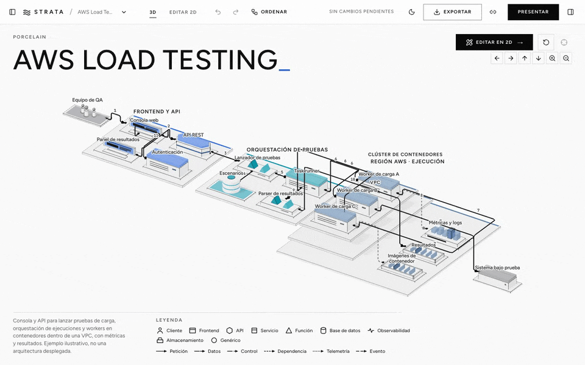

<div align="center">

# Strata Diagram Studio

**Editor de diagramas de arquitectura con un único documento semántico y dos vistas:
un editor 2D y una escena 3D isométrica real.**

Sin backend, sin claves, sin cuentas. Todo vive en tu navegador.

[](https://github.com/enshetinin/strata-diagram-studio/actions/workflows/ci.yml)
[](LICENSE)
[](https://nodejs.org/)
[](https://pnpm.io/)
[](https://www.w3.org/TR/WCAG22/)

[](https://www.typescriptlang.org/)
[](https://react.dev/)
[](https://threejs.org/)
[](https://reactflow.dev/)
[](https://vite.dev/)
[](https://biomejs.dev/)
[](https://vitest.dev/)
[](https://playwright.dev/)



</div>

---

## Índice

- [Características](#características)
- [Inicio rápido](#inicio-rápido)
- [Scripts disponibles](#scripts-disponibles)
- [Guía de uso](#guía-de-uso)
- [Plantillas y estilos](#plantillas-y-estilos)
- [Arquitectura](#arquitectura)
- [Modelo de datos](#modelo-de-datos)
- [Persistencia, importación y exportación](#persistencia-importación-y-exportación)
- [Generación de diagramas](#generación-de-diagramas)
- [Rendimiento y accesibilidad](#rendimiento-y-accesibilidad)
- [Calidad e integración continua](#calidad-e-integración-continua)
- [Documentación](#documentación)
- [Hoja de ruta](#hoja-de-ruta)
- [Limitaciones conocidas](#limitaciones-conocidas)
- [Contribuir](#contribuir)
- [Créditos](#créditos)
- [Licencia](#licencia)

## Características

- **Un documento, dos vistas.** Un único `DiagramDocument` en JSON alimenta el editor 2D
  ([React Flow](https://reactflow.dev/)) y la escena 3D ([Three.js](https://threejs.org/) /
  [React Three Fiber](https://r3f.docs.pmnd.rs/)). Ninguna vista guarda una copia editable propia.
- **Edición 2D tipo Figma.** Puertos tipados con validación de conexiones, grupos anidados,
  marco de selección, minimapa, ajuste a rejilla y auto-layout con [ELK](https://eclipse.dev/elk/).
- **Escena 3D isométrica.** Cuatro estilos visuales, plataformas por grupo, conectores con rutas
  que evitan volúmenes y partículas de flujo ilustrativas.
- **Recorridos narrativos.** Pasos ordenados que iluminan relaciones, con un modo presentación a
  pantalla completa.
- **Compartir sin servidor.** El diagrama se comprime en el fragmento de la URL y se abre en solo
  lectura.
- **Exportación** a JSON, SVG vectorial (2D) y PNG de alta resolución (3D, hasta 4K).
- **Seis plantillas** de arquitecturas reales y un generador local basado en reglas.
- **Accesible** según WCAG 2.2 AA: todo el grafo se puede editar sin el canvas 3D.

## Inicio rápido

### Requisitos

| Herramienta | Versión |
| --- | --- |
| Node.js | 22 o superior (probado con 24.21) |
| pnpm | 12 (probado con 12.9; fijado en `packageManager`) |

### Instalación

```bash
git clone https://github.com/enshetinin/strata-diagram-studio.git
cd strata-diagram-studio
pnpm install
pnpm dev            # http://localhost:5173
```

`pnpm install` ejecuta `postinstall`, que copia las fuentes locales a `public/assets/fonts`.

### Build de producción

```bash
pnpm build          # typecheck + build en dist/
pnpm preview        # sirve dist/ en http://localhost:4173
```

El resultado es un sitio estático: `dist/` se puede desplegar en cualquier hosting de archivos.

## Scripts disponibles

| Script | Descripción |
| --- | --- |
| `pnpm dev` | Servidor de desarrollo Vite |
| `pnpm build` | Typecheck (`tsc -b`) y build de producción en `dist/` |
| `pnpm preview` | Sirve el contenido de `dist/` |
| `pnpm check` | Biome: formato, orden de imports y lint. **Debe pasar antes de cada commit** |
| `pnpm lint` | Solo el lint de Biome (reglas recomendadas + hooks de React) |
| `pnpm format` | Formatea el código con Biome |
| `pnpm typecheck` | TypeScript en modo strict, sin emitir |
| `pnpm test` | Tests unitarios con Vitest |
| `pnpm test:e2e` | Flujos de navegador con Playwright (ver nota abajo) |
| `pnpm qa:screens` | Regenera las capturas de `docs/qa/` (`QA_GPU=metal` para usar la GPU en macOS) |
| `pnpm fonts` | Copia las fuentes OFL locales a `public/assets/fonts` |

> [!NOTE]
> La primera vez que ejecutes los tests e2e instala el navegador:
> `pnpm exec playwright install chromium`.

**Medición de rendimiento:** ejecuta `pnpm build && pnpm preview` y, en otra terminal,
`node scripts/measure-perf.mjs http://localhost:4173 [--gpu]`.

## Guía de uso

### Primer arranque

Se abre la plantilla **AWS Load Testing** en 3D isométrico, con título, leyenda y el botón
**Editar en 2D**, que lleva al elemento seleccionado.

### Vista 3D

- Órbita limitada, pan y zoom. Clic selecciona; doble clic enfoca.
- La selección resalta los vecinos y atenúa el resto.
- Un grupo se puede aislar desde *Estructura* o el inspector. La cámara se puede restablecer.

### Editor 2D

- **Crear:** botón «Añadir» de la barra, «+» o arrastrando desde *Biblioteca* (también sobre un grupo).
- **Conectar** puerto a puerto, con feedback verde/rojo y el motivo del rechazo. Un extremo se
  reconecta arrastrándolo.
- **Ajustar rutas:** el tramo central de una relación seleccionada se puede mover; doble clic o
  «Ordenar» lo restablecen.
- **Organizar:** agrupar, desagrupar, duplicar, borrar, redimensionar grupos, minimapa y ajuste a rejilla.
- **Lienzo tipo Figma:** arrastrar sobre el vacío (también dentro de un grupo) dibuja un marco de
  selección (Mayús suma a la selección). Los grupos se seleccionan por su etiqueta. Pan con
  espacio + arrastrar, botón central/derecho o scroll del trackpad; zoom con pellizco o Ctrl/⌘ + rueda.

### Copiar y pegar

Nodos y grupos (con su contenido y relaciones internas) se copian al portapapeles del sistema como
JSON, así que funciona entre pestañas y documentos. En 2D se pega bajo el cursor y dentro del grupo
que haya debajo; sin cursor, en cascada respecto al original. Pegar el JSON de un documento completo
inserta todo su contenido. Los IDs se regeneran y el orden del recorrido no se copia.

### Paneles

| Lado | Panel | Contenido |
| --- | --- | --- |
| Izquierda | *Estructura* | Lista accesible del grafo y aislamiento de grupos |
| Izquierda | *Biblioteca* | Tipos de nodo para arrastrar al lienzo |
| Derecha | *Inspector* | Etiqueta, descripción, tipo, proveedor, grupo, puertos tipados, metadatos JSON; relaciones (tipo, etiqueta, dirección, paso, explicación, invertir) y grupos |
| Derecha | *Recorrido* | Pasos narrativos ordenados |
| Derecha | *Apariencia* | Estilo, espaciado del auto-layout, altura de capas, densidad de etiquetas, cámara, partículas, calidad y «Probar otra apariencia» (estilo/layout al azar sin tocar el grafo) |

### Recorrido y presentación

- Cada paso tiene título, texto y las relaciones que ilumina. Se crea a partir de la selección, se
  reordena arrastrando o con Alt+↑/↓ y se puede presentar desde cualquier paso.
- Un paso sin relaciones sirve de introducción o resumen. Abrir un paso lo resalta en 2D y 3D.
- Cada relación pertenece como mucho a un paso; su marcador numerado (`order`) se renumera solo.
- **Presentar** oculta los paneles, encuadra y recorre los pasos (←/→ para navegar, Esc para salir).

### Menú de documento

El chevron junto al nombre ofrece: nuevo diagrama en blanco, plantillas, generar una nueva
arquitectura e importar JSON. Todas estas acciones reemplazan el diagrama actual (solo se guarda
uno) y el aviso posterior ofrece «Deshacer».

### Atajos de teclado

Se ignoran mientras se escribe en un campo.

| Acción | Atajo |
| --- | --- |
| Deshacer | <kbd>Ctrl/⌘</kbd> + <kbd>Z</kbd> |
| Rehacer | <kbd>Ctrl/⌘</kbd> + <kbd>Shift</kbd> + <kbd>Z</kbd> o <kbd>Ctrl</kbd> + <kbd>Y</kbd> |
| Copiar / cortar / pegar | <kbd>Ctrl/⌘</kbd> + <kbd>C</kbd> / <kbd>X</kbd> / <kbd>V</kbd> |
| Duplicar | <kbd>Ctrl/⌘</kbd> + <kbd>D</kbd> |
| Agrupar / desagrupar | <kbd>Ctrl/⌘</kbd> + <kbd>G</kbd> / <kbd>Ctrl/⌘</kbd> + <kbd>Shift</kbd> + <kbd>G</kbd> |
| Guardar | <kbd>Ctrl/⌘</kbd> + <kbd>S</kbd> |
| Borrar | <kbd>Supr</kbd> / <kbd>Retroceso</kbd> |
| Enfocar selección | <kbd>F</kbd> |
| Deseleccionar | <kbd>Esc</kbd> |
| Mover en 2D | Flechas (con <kbd>Mayús</kbd>: ×4) |
| Reordenar paso del recorrido | <kbd>Alt</kbd> + <kbd>↑</kbd> / <kbd>↓</kbd> |

### Compartir

El botón de enlace genera una URL con el diagrama comprimido en el fragmento (`#s=1.…`, deflate +
base64url, ~2–3 mil caracteres para las plantillas). **No se sube a ningún servidor.**

Al abrirla, el diagrama se muestra en **solo lectura**: el autosave queda en pausa y el diagrama
guardado no se toca. Desde ahí se puede presentar, volver al diagrama propio o editar una copia
(pide confirmación y guarda una copia de seguridad del anterior en `strata:replaced:<fecha>`).
Añadir `&p=1` abre el enlace directamente en modo presentación.

### Parámetros de URL

| Parámetro | Valores | Efecto |
| --- | --- | --- |
| `template` | `rag`, `aws-load-testing`, `multi-agent`, `event-commerce`, `data-platform`, `edge-iot` | Abre una plantilla |
| `style` | `porcelain`, `editorial`, `midnight`, `blueprint` | Aplica un estilo (los antiguos `glass`, `monochrome` y `orbit` abren su equivalente) |
| `mode` | `2d` | Arranca en el editor 2D |
| `panels` | `closed` | Arranca con los paneles cerrados |
| `variation` | `<categoría>:<seed>:<complejidad>`, p. ej. `iot:42:3` | Genera una variante local |
| `stress` | `1` | Carga el fixture de 100 nodos / 150 relaciones para medir |

Ejemplo: `http://localhost:5173/?template=rag&style=midnight&mode=2d`.

## Plantillas y estilos

| Plantilla | Topología | Estilo recomendado |
| --- | --- | --- |
| AWS Load Testing | Tres plataformas de dominio, región › VPC › clúster, recorrido numerado | Porcelain |
| RAG documental | Dos carriles (ingesta / consulta) unidos por embeddings e índice | Midnight + capas translúcidas |
| Sistema multiagente | Coordinador central, satélites, herramientas y memoria; ciclo de revisión | Midnight |
| Comercio por eventos | Flujo principal, ramas de consumidores, retornos al bus, DLQ | Editorial |
| Plataforma de datos | Etapas izquierda→derecha, lakehouse con banda medallion anidada | Blueprint |
| Edge / IoT | Clusters de campo separados que convergen en una región; OTA de vuelta | Porcelain + conectores en arco, perspectiva |

Las plantillas son ejemplos ilustrativos, no infraestructura desplegada.

Los **cuatro estilos** (Porcelain, Editorial, Midnight y Blueprint) cambian materiales, geometría
de plataformas, luz, cámara y conectores (tubos, líneas finas, arcos), **nunca el grafo**. Las
capturas de cada combinación están en [`docs/qa/`](docs/qa/).

## Arquitectura

```text
src/
├── domain/         tipos, esquemas Zod, invariantes, comandos puros, parse/migración, geometría
├── state/          documentStore (documento + historial), uiStore, preferencesStore, actions
├── features/
│   ├── layout/       ELK (auto-layout) y sceneModel (2D → mundo 3D, rutas)
│   ├── editor2d/     adaptador React Flow
│   ├── viewer3d/     escena R3F: temas, materiales, plataformas, conectores, etiquetas, cámara
│   ├── templates/    plantillas, DSL de autoría, generador por reglas y fixture de rendimiento
│   ├── generation/   proveedor local/remoto, validación y vista previa
│   ├── persistence/  autosave y carga validada con copia de seguridad
│   ├── export/       JSON, SVG y PNG
│   ├── share/        codificación del documento en la URL
│   └── theme/        tokens de diseño compartidos por las vistas
├── app/            shell, paneles, diálogos, atajos y arranque
├── components/ui/  componentes de interfaz reutilizables
└── styles/         tokens y hojas de estilo
```

Principios clave:

1. **Un documento, dos adaptadores.** React Flow y Three reciben modelos *derivados* del documento;
   ninguno guarda estado editable propio.
2. **Comandos puros con historial por instantáneas.** Cada comando devuelve un documento nuevo o
   lanza `CommandError`; el store valida las invariantes antes de aceptar el cambio (máx. 100
   entradas de historial).
3. **Auto-layout explícito y cancelable.** ELK se carga bajo demanda y descarta resultados obsoletos.
4. **Render bajo demanda.** `frameloop="demand"`; sin `setState` por frame.

Las decisiones completas están en [`docs/architecture.md`](docs/architecture.md).

## Modelo de datos

```ts
DiagramDocument {
  schemaVersion: 1; id; name; description;
  nodes:  { id, kind, label, description?, provider?, ports: Port[], groupId, metadata }[]
  groups: { id, label, description?, kind, parentGroupId }[]
  edges:  { id, source: {nodeId, portId}, target: {nodeId, portId}, relation, label?, direction, order?, explanation? }[]
  layout: { nodes: Record<id, Rect>, groups: Record<id, Rect> }   // px, locales al contenedor
  presentation: { styleId, camera: { projection }, appearance: { spacing, layerHeight, labelMode, flowParticles, connectorRoute, translucentLayers } }
  narrative: { steps: { id, title, caption?, edgeIds }[] }
}
```

- `narrative.steps` es la fuente del recorrido. `edge.order` es su reflejo (la posición del paso
  que narra la relación) y lo leen los marcadores de 2D, 3D y SVG. Un documento sin pasos
  explícitos deriva el recorrido de `order`; la primera edición lo convierte en pasos explícitos.
- **Tipos de nodo:** cliente, frontend, API, servicio, función, base de datos, almacenamiento,
  cola, caché, agente, modelo, herramienta, gateway, observabilidad y genérico.
- Los ciclos entre relaciones son válidos; los ciclos de pertenencia entre grupos no.

Sistema de coordenadas y escala: [`docs/coordinates.md`](docs/coordinates.md).

## Persistencia, importación y exportación

**Guardado**

- Autosave local con debounce de 700 ms y guardado manual.
- Al cargar se valida el documento. Si los datos están dañados o son de otra versión, se avisa,
  se copian a `strata:recovered:<fecha>` y se abre la plantilla por defecto.
- Si se agota la cuota de almacenamiento, se avisa para exportar a JSON.

**Importación**

- JSON de hasta 2 MB, validado con Zod, con límites de recuento y comprobación referencial.
- Las versiones de esquema desconocidas se rechazan explícitamente. Un import inválido no cambia nada.

**Exportación**

| Formato | Origen | Detalles |
| --- | --- | --- |
| JSON | Documento | Portable y reimportable |
| SVG | Vista 2D | Vectorial, con fuentes incrustadas |
| PNG | Escena 3D | 16:9 Full HD, 4K, 1:1 o 4:5; opaco o transparente; título, descripción y leyenda opcionales. Las últimas opciones se recuerdan en el navegador |

## Generación de diagramas

| Modo | Disponibilidad | Cómo funciona |
| --- | --- | --- |
| **Local** | Siempre | Generador basado en reglas por categoría, seed y complejidad. No interpreta lenguaje natural, y la interfaz lo indica |
| **Remoto** | Opcional | Backend propio que implemente [`docs/generation-contract.md`](docs/generation-contract.md) |

Para activar el modo remoto, define la variable de entorno:

```bash
VITE_STRATA_GENERATOR_URL=https://tu-backend.example.com
```

> [!IMPORTANT]
> Las claves de API viven en el servidor, **nunca** en variables `VITE_*`, en el bundle ni en
> `localStorage`. Este repositorio no incluye backend.

Sin proveedor configurado, el campo de texto solo sugiere plantillas compatibles por palabras clave.

## Rendimiento y accesibilidad

**Rendimiento**

- La escena 3D se carga bajo demanda, usa un solo canvas y renderiza solo cuando algo cambia.
- DPR limitado según la calidad elegida, degradación automática y fallback a 2D si falta o se
  pierde el contexto WebGL.
- Medido (detalles en [`docs/qa.md`](docs/qa.md)): fixture de 100 nodos / 150 relaciones a
  **60 fps (p95 16,8 ms)** en Apple M3 vía ANGLE/Metal; ≈ 6 fps con SwiftShader (CPU).

**Accesibilidad (WCAG 2.2 AA)**

- La lista del grafo (*Estructura*), el inspector y el editor 2D permiten trabajar sin el canvas 3D.
- Foco visible, pestañas y menús operables con teclado y diálogos nativos.
- Se respeta `prefers-reduced-motion` (cámara y partículas).
- Auditoría automática con axe-core en los tests de Playwright.

## Calidad e integración continua

Cada push y pull request a `main` ejecuta [el workflow de CI](.github/workflows/ci.yml):

```text
pnpm install --frozen-lockfile  →  lint  →  typecheck  →  tests unitarios  →  build
```

| Capa | Herramienta | Ubicación |
| --- | --- | --- |
| Lint y formato | Biome | `biome.json` |
| Tipos | TypeScript strict | `tsconfig.*.json` |
| Unitarios | Vitest + jsdom | `src/**/*.test.ts` |
| End-to-end y accesibilidad | Playwright + axe-core | `tests/e2e/` |
| Regresión visual | Playwright | `tests/qa/` → `docs/qa/` |

## Documentación

| Documento | Contenido |
| --- | --- |
| [`docs/architecture.md`](docs/architecture.md) | Capas y decisiones de arquitectura |
| [`docs/coordinates.md`](docs/coordinates.md) | Sistema de coordenadas y escala 2D ↔ 3D |
| [`docs/generation-contract.md`](docs/generation-contract.md) | Contrato HTTP del generador remoto |
| [`docs/qa.md`](docs/qa.md) | Mediciones de rendimiento y comprobaciones manuales |
| [`docs/assets.md`](docs/assets.md) | Fuentes, iconos y licencias de terceros |

## Hoja de ruta

Disponible: todo lo descrito arriba. Extensiones previstas, **aún no implementadas**:

- [ ] Backend de generación de referencia
- [ ] Edición estructural directa en 3D (arrastrar y conectar)
- [ ] Tooltips en la escena 3D
- [ ] Colaboración en tiempo real
- [ ] Migraciones de esquema más allá de la v1
- [ ] Exportación vectorial de la vista 3D
- [ ] Evitación de obstáculos en las rutas 2D

## Limitaciones conocidas

- Las rutas 2D usan el trazado *smoothstep* de React Flow y pueden cruzar nodos; las rutas 3D sí
  evitan volúmenes.
- En pantallas muy estrechas la escena 3D se ve pequeña y solo se etiquetan los nodos principales.
- ELK se ejecuta en el hilo principal (cargado bajo demanda); en documentos grandes puede tardar
  ~100 ms.
- Los tests de navegador solo se ejecutan en Chromium. Las comprobaciones manuales pendientes
  están en [`docs/qa.md`](docs/qa.md).

## Contribuir

1. Crea una rama desde `main` (`feat/…`, `fix/…`, `chore/…`).
2. Antes de abrir el pull request, verifica que todo pasa en local:

   ```bash
   pnpm check && pnpm typecheck && pnpm test && pnpm build
   ```

3. Si cambias la interfaz, ejecuta `pnpm test:e2e` y, si procede, regenera las capturas con
   `pnpm qa:screens`.
4. Abre el pull request contra `main`; la CI debe pasar en verde.

## Créditos

- Fuentes [Figtree](https://fonts.google.com/specimen/Figtree) y
  [JetBrains Mono](https://www.jetbrains.com/lp/mono/) (SIL OFL 1.1), servidas localmente.
- Iconos [Lucide](https://lucide.dev/) (ISC) y glifos geométricos propios.
- Sin logos oficiales de terceros. Detalles en [`docs/assets.md`](docs/assets.md).

## Licencia

Distribuido bajo la licencia [MIT](LICENSE). © 2026 Yev.
