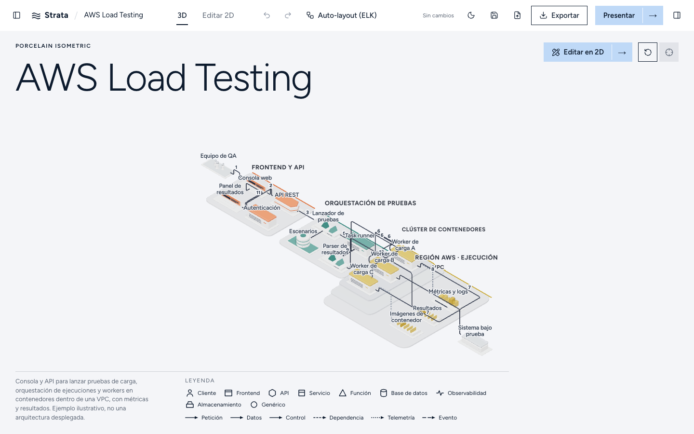

# Strata Diagram Studio

Editor de diagramas de sistemas con un único documento semántico y dos vistas: un editor 2D
(React Flow) y una escena 3D real (Three.js / React Three Fiber) con estilos isométricos.
Funciona sin claves ni backend.



## Puesta en marcha

Requisitos: Node 22+ (probado con 24.21) y pnpm (probado con 12.9).

```bash
pnpm install
pnpm dev            # http://localhost:5173
```

| Script | Qué hace |
| --- | --- |
| `pnpm dev` | servidor de desarrollo Vite |
| `pnpm build` | typecheck (`tsc -b`) + build de producción en `dist/` |
| `pnpm preview` | sirve `dist/` |
| `pnpm lint` | ESLint (typescript-eslint + reglas de hooks) |
| `pnpm typecheck` | TypeScript strict sin emitir |
| `pnpm test` | tests unitarios (Vitest) |
| `pnpm test:e2e` | flujos de navegador (Playwright; la primera vez: `pnpm exec playwright install chromium`) |
| `pnpm qa:screens` | regenera las capturas de `docs/qa/` (`QA_GPU=metal` para usar la GPU en macOS) |
| `pnpm fonts` | copia las fuentes OFL locales a `public/assets/fonts` (también en `postinstall`) |

Medición de rendimiento: `pnpm build && pnpm preview`, y en otra terminal
`node scripts/measure-perf.mjs http://localhost:4173 [--gpu]`.

## Uso

- **Primer arranque**: plantilla AWS Load Testing en 3D isométrico, con título, leyenda y el botón
  **Editar en 2D** (lleva al elemento seleccionado).
- **3D**: órbita limitada, pan y zoom; clic selecciona, doble clic enfoca; la selección resalta
  vecinos y atenúa el resto. Aislar un grupo desde *Estructura* o el inspector. Restablecer cámara.
- **2D**: crear (botón «+» o arrastrando desde *Biblioteca*, también sobre un grupo), arrastrar,
  conectar puerto a puerto (feedback verde/rojo y motivo del rechazo), reconectar arrastrando un
  extremo, agrupar, desagrupar, duplicar, borrar, redimensionar grupos, minimapa y ajuste a rejilla.
- **Inspector**: etiqueta, descripción, tipo, proveedor, grupo, puertos tipados, metadatos JSON;
  relaciones (tipo, etiqueta, dirección, orden en el recorrido, explicación, invertir); grupos.
- **Apariencia**: seis estilos, espaciado del auto-layout, altura de capas, densidad de etiquetas,
  cámara, partículas ilustrativas y calidad (preferencia local).
- **Presentar**: oculta paneles, encuadra y recorre los pasos numerados (←/→, Esc).
- **Generar**: «Nueva arquitectura» (reglas locales con seed y complejidad), «Nueva apariencia»
  (estilo/layout sin tocar el grafo) y descripción en texto (requiere proveedor; ver abajo).

Atajos (ignorados mientras se escribe): Ctrl/⌘+Z deshacer, Ctrl/⌘+Shift+Z o Ctrl+Y rehacer,
Supr/Retroceso borrar, Ctrl/⌘+D duplicar, Ctrl/⌘+G agrupar, Ctrl/⌘+Shift+G desagrupar,
Ctrl/⌘+S guardar, F enfocar, Esc deseleccionar, flechas mover en 2D (Mayús: ×4).

Parámetros de URL útiles: `?template=rag|aws-load-testing|multi-agent|event-commerce|data-platform|edge-iot`,
`&style=porcelain|midnight|glass|blueprint|monochrome|orbit`, `&mode=2d`, `&panels=closed`,
`?variation=iot:42:3`, `?stress=1` (fixture 100/150 para medir).

## Plantillas y estilos

| Plantilla | Topología | Estilo recomendado |
| --- | --- | --- |
| AWS Load Testing | Tres plataformas de dominio, región › VPC › clúster, recorrido numerado | Porcelain Isometric |
| RAG documental | Dos carriles (ingesta / consulta) unidos por embeddings e índice | Glass Layers |
| Sistema multiagente | Coordinador central, satélites, herramientas y memoria; ciclo de revisión | Midnight Signal |
| Comercio por eventos | Flujo principal, ramas de consumidores, retornos al bus, DLQ | Monochrome Editorial |
| Plataforma de datos | Etapas izquierda→derecha, lakehouse con banda medallion anidada | Blueprint Spatial |
| Edge / IoT | Clusters de campo separados que convergen en una región; OTA de vuelta | Orbit Atlas |

Son ejemplos ilustrativos, no infraestructura desplegada. Los estilos cambian materiales,
geometría de plataformas, luz, cámara (Orbit usa perspectiva) y conectores (tubos, líneas finas,
arcos), nunca el grafo. Capturas: `docs/qa/`.

## Modelo de datos

```ts
DiagramDocument {
  schemaVersion: 1; id; name; description;
  nodes:  { id, kind, label, description?, provider?, ports: Port[], groupId, metadata }[]
  groups: { id, label, description?, kind, parentGroupId }[]
  edges:  { id, source: {nodeId, portId}, target: {nodeId, portId}, relation, label?, direction, order?, explanation? }[]
  layout: { nodes: Record<id, Rect>, groups: Record<id, Rect> }   // px, locales al contenedor
  presentation: { styleId, camera: { projection }, appearance: { spacing, layerHeight, labelMode, flowParticles } }
  narrative: { steps: { id, title, caption?, edgeIds }[] }
}
```

Tipos de nodo: cliente, frontend, API, servicio, función, base de datos, almacenamiento, cola,
caché, agente, modelo, herramienta, gateway, observabilidad y genérico. Los ciclos de relaciones son
válidos; los de pertenencia entre grupos no. Coordenadas y escala: [`docs/coordinates.md`](docs/coordinates.md).
Decisiones: [`docs/architecture.md`](docs/architecture.md).

## Guardado, importación y exportación

- Autosave local con debounce (700 ms) y guardado manual. Al cargar se valida; si los datos están
  dañados o son de otra versión se avisa, se copian a `strata:recovered:<fecha>` y se abre la
  plantilla por defecto. Error de cuota → aviso para exportar JSON.
- Importar JSON: límite 2 MB, Zod, límites de recuento y comprobación referencial; versiones
  desconocidas se rechazan explícitamente. Un import inválido no cambia nada.
- Exportar: JSON portable; **SVG** de la vista 2D (vectorial, fuentes incrustadas); **PNG** de la
  escena 3D a 1920×1080, opaco o transparente, con etiquetas y flechas WebGL. Los overlays DOM
  (título, leyenda) no forman parte del PNG.

## Generación

- **Local (siempre disponible)**: generador basado en reglas por categoría, seed y complejidad.
  No interpreta lenguaje natural y la interfaz lo dice.
- **Remota (opcional)**: define `VITE_STRATA_GENERATOR_URL` con la URL de un backend propio que
  implemente [`docs/generation-contract.md`](docs/generation-contract.md). Las claves viven en el
  servidor; nunca en `VITE_*`, el bundle o localStorage. Este repositorio **no** incluye backend.
- Sin proveedor, el campo de texto solo sugiere plantillas compatibles por palabras clave.

## Rendimiento y accesibilidad

- 3D cargado bajo demanda, un canvas, render bajo demanda, DPR limitado por calidad, degradación
  automática y fallback 2D ante falta/pérdida de WebGL.
- Medido (detalles en [`docs/qa.md`](docs/qa.md)): fixture de 100 nodos / 150 relaciones a 60 fps
  (p95 16,8 ms) en Apple M3 vía ANGLE/Metal; ≈ 6 fps con SwiftShader (CPU).
- Lista accesible del grafo (*Estructura*), inspector y editor 2D permiten trabajar sin el canvas
  3D; foco visible, pestañas y menús con teclado, diálogos nativos, `prefers-reduced-motion`
  respetado (cámara y partículas).

## Assets

Fuentes Figtree y JetBrains Mono (SIL OFL 1.1, servidas localmente), iconos
Lucide (ISC) y glifos geométricos propios. Sin logos oficiales. Ver [`docs/assets.md`](docs/assets.md).

## Disponible vs. futuro

Disponible: todo lo descrito arriba. Extensiones futuras (no implementadas): backend de
generación de referencia, edición estructural directa en 3D (arrastrar/conectar), tooltips 3D,
colaboración, migraciones de esquema más allá de la v1, exportación vectorial de la vista 3D y
evitación de obstáculos en las rutas 2D.

## Limitaciones conocidas

- Las rutas 2D usan el trazado smoothstep de React Flow y pueden cruzar nodos; las 3D sí evitan
  volúmenes.
- En pantallas muy estrechas la escena 3D se ve pequeña; se etiquetan solo los nodos principales.
- ELK se ejecuta en el hilo principal (cargado bajo demanda); en documentos grandes puede tardar
  ~100 ms.
- Tests de navegador solo en Chromium. Ver la lista de comprobaciones manuales pendientes en
  [`docs/qa.md`](docs/qa.md).
- La imagen de referencia mencionada en `PROMPT.md` (`docs/reference/architecture.png`) no está en
  el repositorio; las plantillas se basan en la descripción textual.
